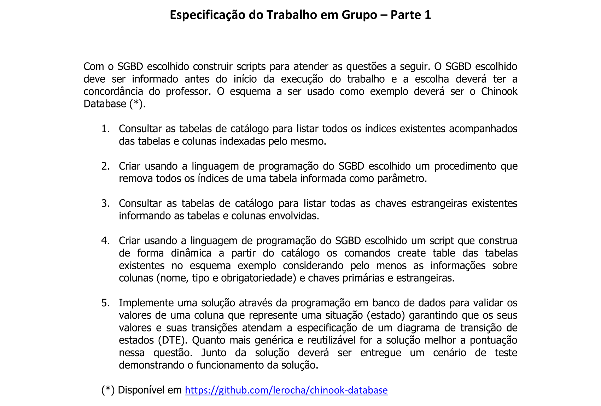
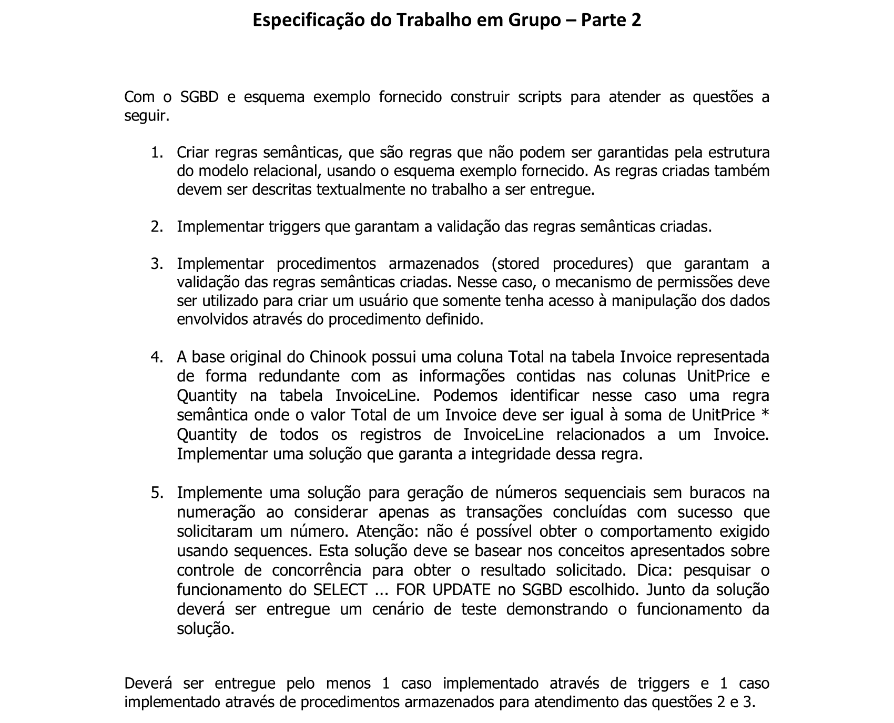
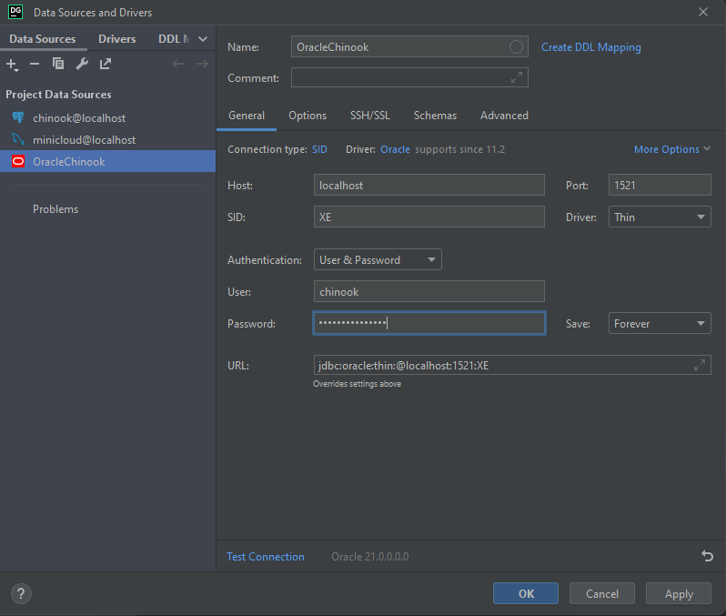

# cs-db2-plsql
Projeto da disciplina TCC00288 - Banco de dados 2 da Universidade Federal Fluminense.

#### `Requisitos`



### `Como Executar`
Basta rodar os seguintes comandos na raiz do projeto:

```bash
user@linux:~$ make up
```

Esses comandos vão buildar e instalar as dependências dentro do contêiner, e rodar os comandos necessários para subir o banco de dados. O "make up" gerará os seguintes comandos no terminal:

```bash
docker-compose build
docker-compose -f docker-compose.yml up -d
```

O make up não exibe o terminal de forma interativa, portanto apenas com esse comando não é possível ver os logs, para ver os logs do container, basta digitar no terminal
```bash
make logs
```
E os logs tanto do MongoDb quanto da API vão aparecer no terminal.

Para parar a execução da aplicação e do banco basta utilizar o comando
```bash
make down
```

Caso queira executar todos os comandos acuma em sequência:
```bash
make rst
```
O make rst chamará os comandos down, up e logs nessa sequência.

### `Como Logar no Oracle XE` 
Utilizando as seguintes credenciais:
Hostname:
    - oracle (caso vá logar de outro container)
    - localhost or 127.0.0.1 (caso vá logar direto da máquina hospedeira)
Port: 1521
Service name: XEPDB1
SID: XE
Database App User: chinook
Database App Password: chinookPassword

No Datagrip


### Material utilizado para montar o ambiente
[Docker Hub gvenzl/oracle-xe](https://hub.docker.com/r/gvenzl/oracle-xe)

### Base da dados exemplo utilizado para realizar os exercícios
[Chinook Database](https://github.com/lerocha/chinook-database)